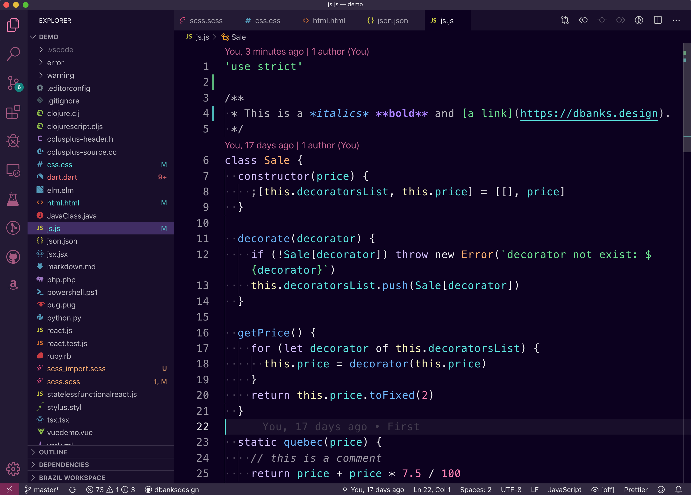

# Nu Disco Theme 🌃

[](https://marketplace.visualstudio.com/items?itemName=dbanksdesign.nu-disco)
[](https://marketplace.visualstudio.com/items?itemName=dbanksdesign.nu-disco)
[](https://marketplace.visualstudio.com/items?itemName=dbanksdesign.nu-disco)

> A VSCode theme that boogies. 💃🕺

Nu Disco is a VSCode theme powered by [Style Dictionary](https://styledictionary.com) and built by [Danny Banks](https://twitter.com/dbanksdesign).



<a href="https://open.spotify.com/playlist/1L2F7UoL4D3UiJPIgOnmub?si=ZR5DZTHeRJWpGJCRTRIFxQ" style="display:inline-block; background:#67E591; color:#0C001F; padding:20px; font-weight:bold;">
Listen to the theme playlist on Spotify 🎧
</a>

## Installation

1. Install [Visual Studio Code](https://code.visualstudio.com/)
1. Launch Visual Studio Code
1. Choose **Extensions** from menu
1. Search for `Nu Disco`
1. Click **Install** to install the extension
1. Click **Reload** to reload VS Code
1. From the menu bar click: Code > Preferences > Color Theme > **Nu Disco Dark**


## Customization

To customize this (or any theme) open the settings with `cmd+,` then go to **Workbench > Appearance** under **Color cCustomizations** click on **Edit in settings.json**.

### Customizing the application colors

To customize application colors, add `workbench.colorCustomizations` attribute to the **settings.json** file like this:

```json
"workbench.colorCustomizations": {
  // If you want to override this for all themes
  "activityBar.background": "#ff0000",
  // If you want to override this for only this theme
  "[Nu Disco Dark]": {
    "activityBar.background": "#ff0000"
  }
}
```

### Customizing the syntax colors

To customize syntax colors, add `editor.tokenColorCustomizations` attribute to the **settings.json** file like this:

```json
"editor.tokenColorCustomizations": {
  // If you want to override all themes
  "textMateRules": [
    {
      "scope": "comment.line",
      "settings": {
        "foreground": "#ff9900"
      }
    }
  ],
  // If you want to only applie overrides to this theme
  "[Nu Disco Dark]": {
    "textMateRules": [
      {
        "scope": "comment.line",
        "settings": {
          "foreground": "#ff9900"
        }
      }
    ]
  }
}
```


## Using this as a template

I build this theme as a proof-of-concept to use Style Dictionary to build a VSCode theme. Feel free to use this as a starting point for creating your own VSCode theme!. I wrote a blog post about this as well.


### Getting started

1. Click on the 'use this template' button on [Github](https://github.com/dbanksdesign/nu-disco-vscode-theme)
1. Install dependencies using yarn or npm
1. Run `npm run build` to create the theme files or run `npm run watch` to watch for file changes and run the build process

When you run `npm run build` or `npm run watch` it will run the **build.js** file which uses Style Dictionary to create the VS Code theme files. Those files will be created in the **build/** directory. 

### About Style Dictionary

If you are unfamiliar with [Style Dictionary](https://styledictionary.com), take a look at the docs to get yourself acquainted. Style Dictionary is a build tool for working with design tokens. Style Dictionary is configuration driven, it will find all your "source" token files, merge theme together, then for each platform defined in the configuration it will perform a series of transforms on each token, then format them all into files. 

* A design token in Style Dictionary is any node in the object that has a `value` attribute.
* Transforms are only run on design tokens. Before any transforms are run, Style Dictionary will set up the token object, adding things like the object path of the token.
* Style Dictionary resolves references or aliases. This allows you to reference any other value in the merged object.

### What to look at

* **build.js**: the build script that runs to create the VSCode theme files in the **build/** directory.
* **tokens/**: contains all the design tokens that will be used to create the VSCode themes
* **tokens/core.json5**: defines the core color palette that is then referenced in theme tokens
* **tokens/[dark|light]/**: defines the theme tokens which are then referenced in [application](#Application-styles) and [syntax](#Syntax-styles) tokens
* **tokens/application**: defines the styles of the editor, which is the `colors` object in a VSCode theme
* **tokens/syntax**: defines the syntax highlighting colors, which are called `tokenColors` in a VSCode theme
* **package.json**: take a look at the scripts which run the build process and look at the VSCode specific attributes
* **demo/**: files used for testing syntax colors. These files were borrowed from [Sarah Drasner's](https://twitter.com/sarah_edo) [Night Owl theme](https://github.com/sdras/night-owl-vscode-theme/) (I added a few more and made some updates as well)


### Making changes

The files you will edit to make changes to the theme are in the **tokens/** directory. If you run `npm start` it will watch for changes to files in those directories and re-run the build process to build new theme files. If you have the Extension Development window open, it will update when it sees changes.

An easy place to start playing around is the **tokens/dark** or **tokens/light** directories. These define theme tokens, which are then referenced in **tokens/application** and **tokens/syntax**.


#### Application styles

You can find these in the **tokens/application** directory. In a VSCode theme file these are the colors in `colors` object. I found it easier to think of these as the styles that affect the VSCode application, which is outside of syntax highlighting. Making changes in these files will affect VSCode, but not syntax highlighting.

These files are commented to help you understand what some of the styles mean. [Here are the full color API docs on VSCode](https://code.visualstudio.com/api/references/theme-color), although I found them a bit lacking sometimes. 


#### Syntax styles

You can find these in the **tokens/syntax** directory. These define syntax highlighting styles in the code editor. Syntaxes break up a text file into scopes, which resemble scopes in Javascript. Each part of the text is part of one or more scopes. 

To learn more about scopes, [this article from SublimeText is helpful](https://www.sublimetext.com/docs/3/scope_naming.html).


## Testing

### Using debug

Press **F5** to start a new debug window with your extension running. If you do this and run `npm start` which will automatically rebuild when it sees file changes, it is sort of like hot reload. 

To help with testing syntax colors, you can use the **Inspect TM Scopes** option by opening the quick command menu with `cmd+shift+p` then search for **Developer: Inspect TM Scopes**. This will show the current element the cursor is on and all the scopes applied to it. The order of the scopes listed matters, the top taking the highest precedence.

### Install your extension locally

To really get a feel for how your theme looks, you can install it locally and use it when you work on other projects for a while. All your extensions stored are in this directory: **~/.vscode/extensions/**. You can [symlink](https://www.makeuseof.com/tag/what-is-a-symbolic-link-what-are-its-uses-makeuseof-explains/) the local extension repository so if you make changes, you can reload the window in VSCode and see the updated theme. You can symlink a directory using the `ln -s` command in Unix based systems (Mac and Linux). Here is what I ran:

`ln -s [path/to/theme] ~/.vscode/extensions/[publisher].[themename]-[version]`

For example:

`ln -s ~/Dev/nu-disco-vscode-theme ~/.vscode/extensions/dbanksdesign.nu-disco-theme-0.0.1`

After you do that, you can set the color theme with cmd K + T and you should see your themes in the list. Then to see changes in your current VS Code window open the quick command panel with **cmd+shift+p**. Then search for **Developer: Reload Window**.

### Testing terminal colors

The theme package has a bash script that will output combinations of ansi colors in the terminal so you can test what they look like. Run `./scripts/color` in the integrated terminal to test.


## Publishing

Before you publish, make sure to edit the **package.json** file with your information. This file is similar to one you would use for an npm package but has some different attributes you should be aware of. 

```json
  "name": "nu-disco",
  "displayName": "Nu Disco Theme",
  "description": "A VSCode theme that boogies.",
  "publisher": "dbanksdesign",
  "galleryBanner": {
    "color": "#0C001F",
    "theme": "dark"
  },
  "icon": "images/icon.png",
  "categories": [
    "Themes"
  ],
  "keywords": [
  ],
  "contributes": {
    "themes": [
      {
        "label": "Nu Disco",
        "uiTheme": "vs-dark",
        "path": "./build/nu-disco-dark.color-theme.json"
      }
    ]
  }
```

* `name` is similar to the name of an npm package. The publisher + name creates the unique identifier. For example, this theme's unique ID is 'dbanksdesign.nu-disco'
* `displayName` is the name displayed when searching/installing the extension
* `description` is the short text displayed in search results and the banner of the detail page.
* `publisher` this is specific to 
* `galleryBanner.color` is the background for the banner on the extension detail page.
* `galleryBanner.theme` Can be dark or light
* `icon` Shows up in the header on the extension detail page and in search results
* `categories` tells VSCode what type of *extension* this is.
* `keywords` Used for search terms
* `contributes` lets VSCode know what this extension includes. Because this is a color theme, we use the `themes` array
  * `label` is the text that shows up in the theme picker.
  * `uiTheme` is the type of theme, has to be one of: "vs" (light), "vs-dark" (dark), or "hc-black" (high contrast).
  * `path` is the path to the theme file. *Note: this file is being generated so you will need to run `npm run build` or `npm start` to create this file. Make sure that the path matches the path used in **build.js***

* [Read more about publishing](https://code.visualstudio.com/api/working-with-extensions/publishing-extension)
* [Extension manifest (package.json) docs](https://code.visualstudio.com/api/references/extension-manifest)
* [Presentation tips](https://code.visualstudio.com/api/references/extension-manifest#marketplace-presentation-tips)


## Contributing

Feel free to [file issues](https://github.com/dbanksdesign/nu-disco-vscode-theme/issues), [submit PRs](https://github.com/dbanksdesign/nu-disco-vscode-theme/pulls) to this repository, or build your own from this!


## Thanks

I started this project after reading this [CSS Tricks article](https://css-tricks.com/creating-a-vs-code-theme/) and looking at [Sarah Drasner's](https://twitter.com/sarah_edo) [Night Owl theme](https://github.com/sdras/night-owl-vscode-theme/). Huge thanks to them!